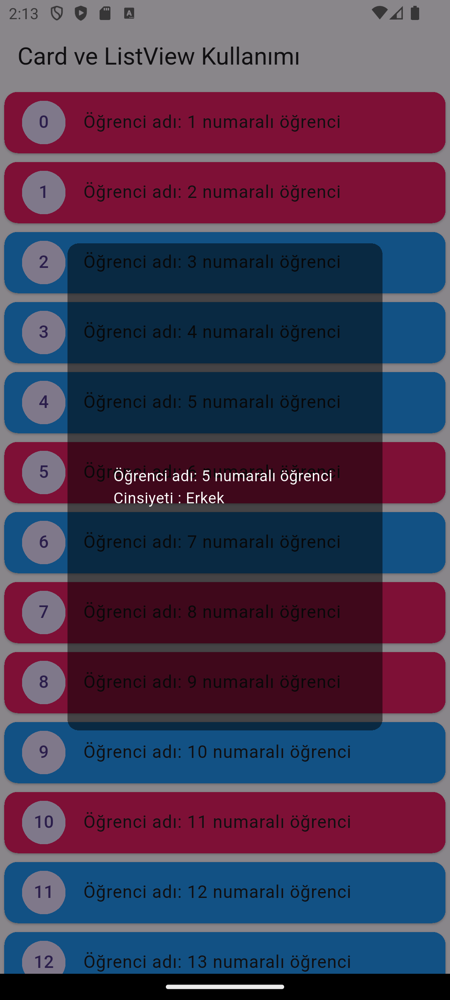
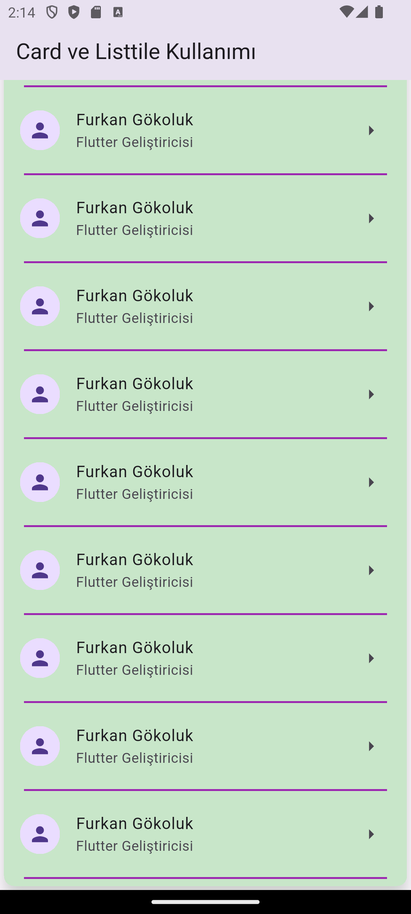
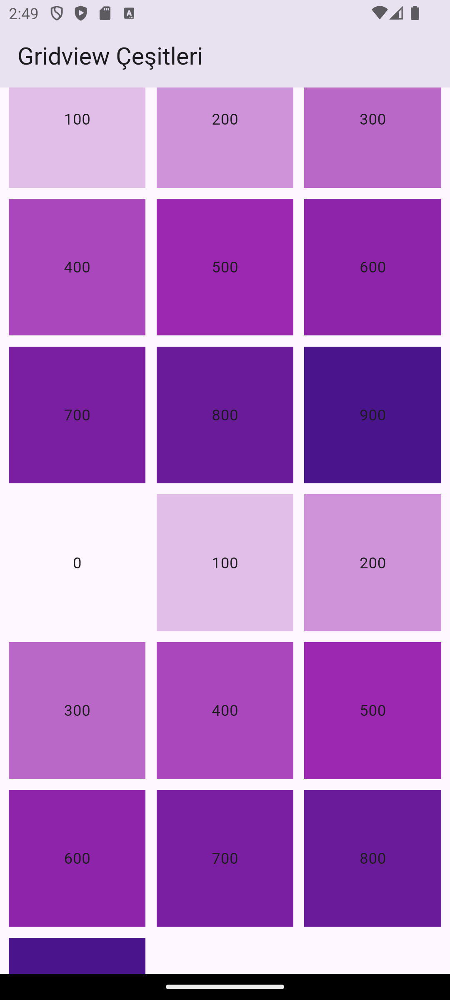
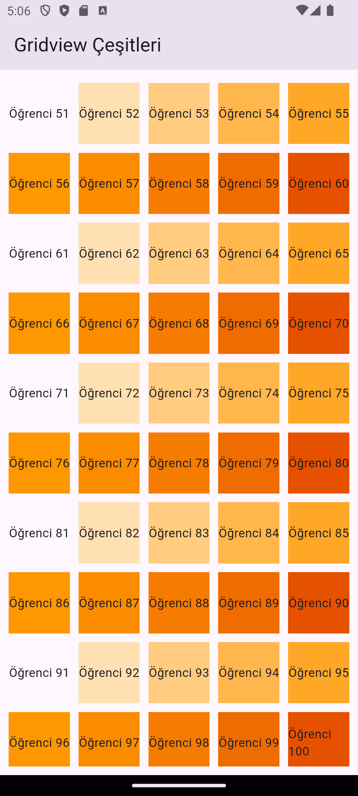
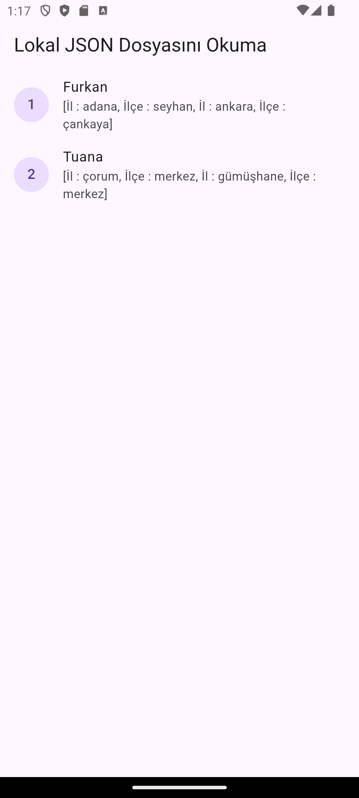
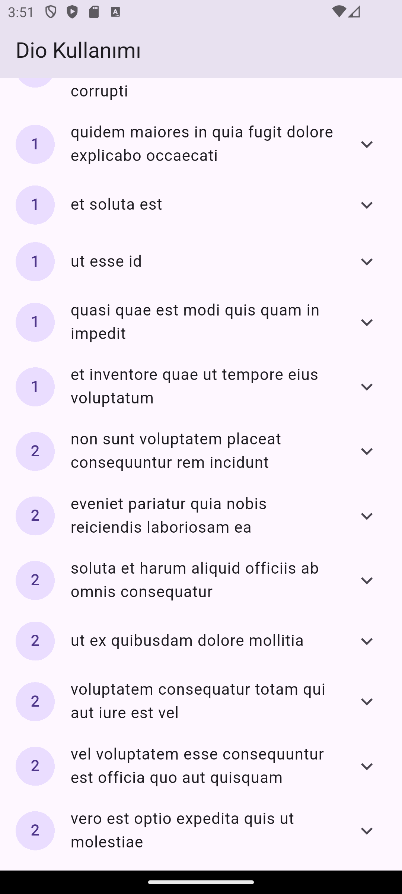
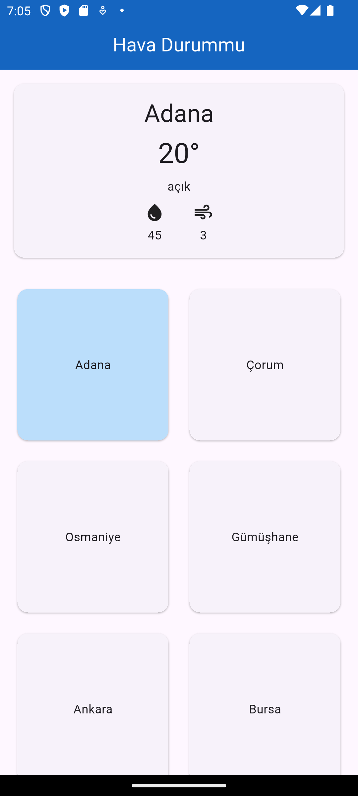

# Data Extraction & Listing (Veri Çekme ve Listeleme)

Bu proje, dış kaynaklardan veri çekme ve Flutter içinde listeleme (card/listview/gridview) konularını öğrenmek üzere hazırlanmış örnek bir uygulamadır.

## Proje Hedefi

- Basit bir REST API'den veya local JSON dosyasından veri çekmek
- Çekilen veriyi modelleyerek ekranda listelemek (Card, ListTile, GridView)
- Dio veya benzeri paketler ile HTTP istekleri yönetimi
- Asenkron/gelecek (Future) yapılarla veri akışını yönetmek

## Proje İçeriği / Öğrenilecekler

- HTTP istekleri (Dio kullanımı)
- JSON -> Dart model dönüşümü (person_model, photos_model)
- FutureBuilder ve asenkron veri akışı
- Card ve ListView / GridView kullanımı
- Asset veri kullanımı (assets/data/persons.json)

## Proje Yapısı

```
lib/
  ├─ main.dart                 # Uygulama giriş noktası
  ├─ dio.dart                  # Dio ile HTTP yardımcı fonksiyonları
  ├─ json_api_future.dart      # API çağrıları ve Future dönüşleri
  ├─ card_listview.dart        # Card ile ListView örneği
  ├─ card_listtile.dart        # Card + ListTile örnekleri
  ├─ gridview_types.dart       # GridView örnekleri
  ├─ models/
  │   ├─ person_model.dart     # Person model
  │   └─ photos_model.dart     # Photos model
  └─ weather_app_example/      # Ayrı bir örnek uygulama (weather)

assets/
  └─ data/
      └─ persons.json          # Local örnek JSON veri
```


## Örnek Ekran Görüntüleri

   
    
 