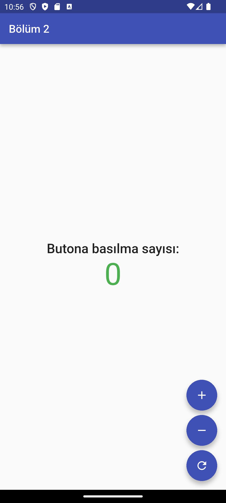
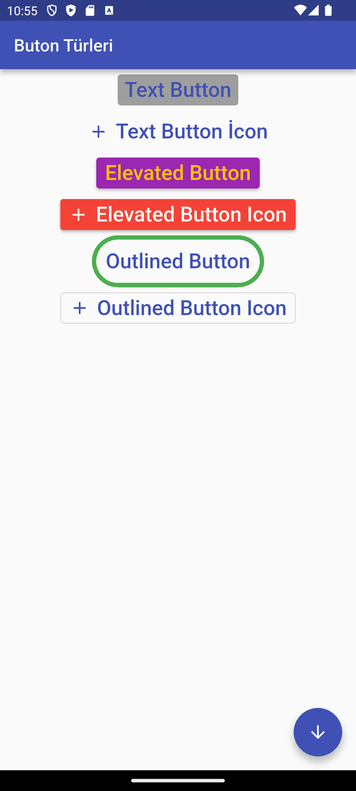
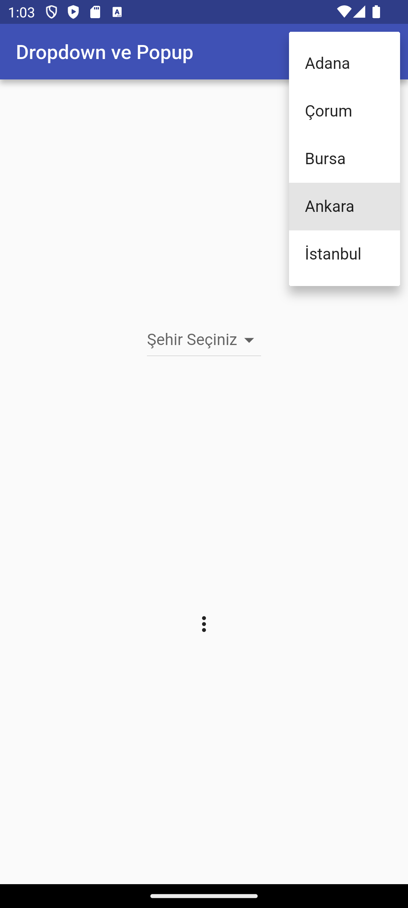
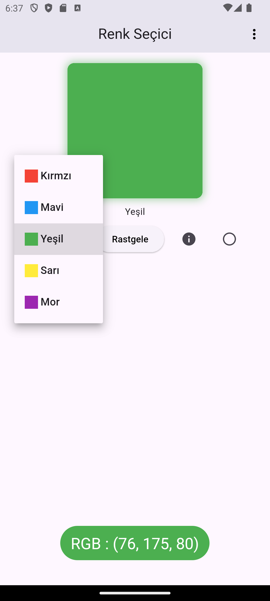

# Flutter Widget Türleri ve Örnekler

Bu proje Flutter'da widget türlerini ve kullanımlarını öğrenmek için oluşturulmuş bir eğitim projesidir.

## Proje İçeriği

Bu projede aşağıdaki Flutter konuları ele alınmıştır:

- Stateless Widgets
- Stateful Widgets
- Image Widget kullanımı
- Button çeşitleri
- Dropdown ve Popup menüler
- Color Picker örneği

## Öğrenilen Kavramlar

- StatelessWidget ve StatefulWidget arasındaki farklar
- setState() kullanımı
- Widget yaşam döngüsü
- Image.asset ve Image.network kullanımı
- Buton türleri ve özellikleri
- Dropdown ve PopupMenuButton kullanımı
- Tema ve renk yönetimi

## Proje Yapısı

```
lib/
  ├── main.dart               # Ana uygulama dosyası
  ├── buttons.dart            # Button örnekleri
  ├── dropdown_popup.dart     # Dropdown ve Popup menü örnekleri
  ├── image_widget.dart       # Image Widget kullanımı
  ├── stateless_stateful.dart # Stateless ve Stateful widget örnekleri
  └── color_picker_example/   # Color Picker uygulaması
      ├── main.dart
      ├── constans/
      ├── pages/
      ├── theme/
      └── widgets/
```

## Örnek Ekran Görüntüleri

Projenin çalışır haldeki ekran görüntüleri aşağıda paylaşılmıştır:






